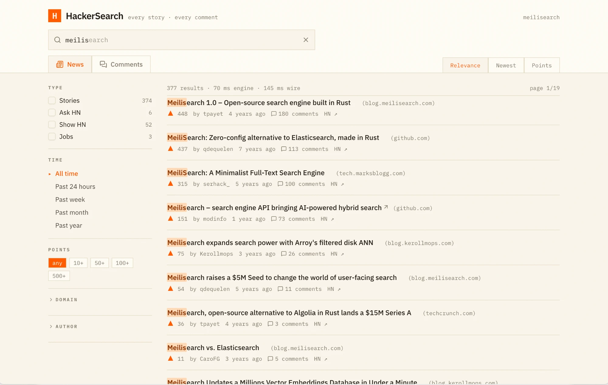

# HackerSearch

**All of Hacker News — every story, every comment — indexed in
[Meilisearch](https://www.meilisearch.com), behind a fast, faceted search UI.**

A full replacement for HN Search: typo-tolerant, prefix-as-you-type keyword
search, disjunctive facets, and optional semantic search over the articles
stories link to.



## Features

- **The whole corpus** — ~45M items, backfilled from the HN Firebase API and
  kept fresh by a live sync every 30 seconds.
- **Search as you type** — prefix and typo-tolerant matching with highlighted
  hits, one Meilisearch `multi-search` round-trip per keystroke.
- **News & Comments tabs** — stories, Ask/Show/Launch HN, jobs and polls on
  one side, comments on the other, each with its own facet rail.
- **Correct facet counts** — type, time, points, domain and author facets use
  disjunctive counting, so a selected filter never zeroes out its siblings.
- **Relevance, Newest, Points** sorting, with points as a relevance tiebreaker.
- **Shareable searches** — all state lives in the URL. Press `/` to focus the
  search box.
- **Semantic search (optional)** — linked articles are crawled and embedded,
  so hybrid search understands what a story is *about*, not just its title.

## Quick start

```sh
docker compose watch
```

Open <http://localhost:3000>. On first boot the indexer applies the index
settings, backfills the most recent 100,000 items (~2 minutes), then follows
new and updated items live every 30 seconds.

> Meilisearch is exposed on host port **7701** (not 7700) to avoid colliding
> with other local instances.

## Architecture

```
┌─────────────┐   Firebase API    ┌────────────┐   REST    ┌──────────────┐
│ Hacker News │ ────────────────▶ │ hn-indexer │ ────────▶ │ Meilisearch  │
└─────────────┘  backfill + sync  │   (Rust)   │           │  hn-stories  │
                                  └────────────┘           │  hn-comments │
                                                           └──────┬───────┘
                                                        multi-search│
                                                           ┌───────▼──────┐
                                                           │  web (Next)  │
                                                           │ faceted UI   │
                                                           └──────────────┘
```

| Path | What it is |
|---|---|
| [`indexer/`](indexer) | `hn-indexer`, a Rust worker: settings, backfill, live sync, article enrichment, embedder setup |
| [`web/`](web) | Next.js App Router UI (Tailwind v4, shadcn/ui, TanStack Query) |
| [`docs/`](docs) | Mintlify documentation site |
| [`compose.yaml`](compose.yaml) | Meilisearch + indexer + web, with `develop.watch` hot reload |

## Indexing the full corpus

A full backfill of ~45M items at the default concurrency (~750 items/s) takes
**≈17 hours** and is fully resumable — kill it any time and it picks up from
its checkpoint.

```sh
# via compose (the checkpoint persists in the indexer_state volume):
BACKFILL_RECENT= docker compose up -d indexer

# or directly on the host:
cd indexer
MEILI_URL=http://localhost:7701 \
MEILI_MASTER_KEY=hackersearch-dev-master-key \
cargo run --release -- backfill
```

## The indexer

```
hn-indexer settings                    # create both indexes + apply search settings
hn-indexer backfill [--recent N]       # index maxitem → 1 (or just last N ids)
hn-indexer backfill --since-days 30    # index everything posted in the last N days
hn-indexer sync [--interval 30]        # follow new + updated items forever
hn-indexer run [--recent N] [--enrich] # settings + backfill + sync (+ enrich), one process
hn-indexer enrich                      # crawl story URLs, store extracted article text
hn-indexer enrich --since 2025-01-01   # …only stories posted on or after a date
hn-indexer enrich --watch              # …and keep going, picking up new stories
hn-indexer embedder openai|voyage      # enable semantic search (stories only, never comments)
hn-indexer ranking                     # push ONLY the ranking rules (no reindex)
hn-indexer dictionary stories|comments # push ONLY the tokenizer dictionary (reindexes that index)
hn-indexer split                       # one-time: migrate the old single `hn` index
```

Deleted and dead items are skipped. Comment HTML is converted to plain text at
index time, so the UI never renders HTML from HN. Paragraphs survive as blank
lines, `<pre>` blocks verbatim, and links as their full `href` (HN's link text
is the URL truncated with `...`).

`settings` pushes the whole definition, which reindexes everything on a
populated index. On production, use the narrow commands instead: `ranking` is
applied at search time and never reindexes; `dictionary` reindexes only the
index you name.

| Env var | Default | Purpose |
|---|---|---|
| `MEILI_URL` | `http://localhost:7700` | Meilisearch endpoint |
| `MEILI_MASTER_KEY` | — | API key |
| `INDEXER_CONCURRENCY` | `128` | Parallel HN API requests |
| `INDEXER_BATCH_SIZE` | `2000` | Ids per chunk / docs per payload |
| `INDEXER_STATE_FILE` | `indexer-state.json` | Resume checkpoint |
| `BACKFILL_RECENT` | — | Limit `run` backfill depth (unset = full corpus) |
| `SYNC_INTERVAL` | `30` | Live-sync poll seconds |
| `ENRICH_ON_SYNC` | — | Enrich continuously inside `run` (compose sets `true`) |
| `ENRICH_SINCE` | — | Only enrich stories from this date on (compose: `2025-01-01`) |
| `ENRICH_MAX_CHARS` | `4000` | Characters of article text kept per document |
| `ENRICH_EXTRACTOR` | `auto` | `auto` \| `local` \| `cloudflare` |
| `ENRICH_INTERVAL` | `60` | `--watch` poll seconds |
| `ENRICH_CF_CONCURRENCY` | `6` | Max concurrent Cloudflare renders |
| `CLOUDFLARE_ACCOUNT_ID` | — | Browser Rendering account (enables `auto` fallback) |
| `CLOUDFLARE_API_TOKEN` | — | Browser Rendering token (enables `auto` fallback) |

In production the indexer runs on **qdq-server** (a self-hosted Scaleway
box), next to its Meilisearch, as two systemd units: `hn-indexer` (`sync`) and
`hn-indexer-enrich` (`enrich --watch`). Their config and runbooks live in the
[qdq-server](https://github.com/qdequele/qdq-server) repo under
`meilisearch/`.

## The indexes

Items are split by type into two indexes, one per UI tab:

| Index | Holds | Share of corpus |
|---|---|---|
| `hn-stories` | stories, Ask/Show/Launch HN, jobs, polls, poll options | ~10% |
| `hn-comments` | comments | ~90% |

The tabs never mix the two, so nothing needs federated search. Splitting
means a News query only expands prefixes and typos against story vocabulary
and never loads posting lists padded with 40M comments. Each index is
configured for exactly what its tab queries, and a settings or embedder
change rebuilds one index instead of the whole corpus.

Documents (`id` primary key): `type`, `tags` (`story`, `ask_hn`, `show_hn`,
`launch_hn`, `job`, …), `title`, `text`, `url`, `domain`, `author`, `points`,
`num_comments`, `created_at` (unix seconds), `parent`, plus `content`,
`description` and `enrich_gen` written by `enrich` (stories only).

**`hn-stories`**

- **Searchable**: title, text
- **Facets/filters**: tags, type, url, author, domain, points, num_comments,
  created_at, enrich_gen
- **Sorts**: relevance, newest, points
- **Ranking**: `words`, `typo`, `proximity`, `sort`, `attributeRank`,
  `points:desc`, `wordPosition`, `exactness`. Points rank *before* word
  position and exactness: HN reposts the same link many times, and most
  reposts sink at 1–5 points, so with popularity last a 2-point repost titled
  exactly like the query outranked the 1,767-point original.
- **Dictionary**: `C++`, `C#`, `F#` are kept whole; otherwise `+` and `#` are
  separators and "C++" searches for "c".

**`hn-comments`**

- **Searchable**: text
- **Ranking**: as above, minus `points:desc` (HN exposes no comment scores)
- **Facets/filters**: author, parent (the thread walk), created_at. HN
  exposes no comment scores, so there is no points filter on this tab.
- **Sorts**: relevance, newest

### Migrating from the single `hn` index

Deployments from before the split hold everything in one `hn` index. The new
indexer refuses to run against it and asks for a one-time migration:

1. **Mint a search key** scoped to `["hn-stories", "hn-comments"]`. A key
   scoped to `hn` stops matching anything once the index is renamed.
2. **Stop every writer**: sync *and* enrichment. `split` pages through `hn` by
   offset, so nothing else may write to it meanwhile.
3. **Install the new binary and run `hn-indexer split`.** It is resumable;
   run it somewhere that survives a dropped SSH session.
4. **Deploy the web app** with the new key, as soon as `split` finishes.
5. **Restart sync and enrichment.** Sync resumes from its checkpoint and
   catches up whatever HN posted during the migration.

On qdq-server, the exact commands are in the qdq-server repo,
`meilisearch/README.md` → *Splitting the hn index*. Run it off-peak: the
delete and the comment re-configuration each rewrite the large index, and
Meilisearch's task queue is shared by every index on the instance.

`split` copies the ~5M non-comment documents whole into `hn-stories`, so
crawled `content` and `description` are kept. It checks the copy is
complete, deletes those documents from `hn`, then renames `hn` to
`hn-comments` in place, so the ~40M comments are never moved. Last, it
submits the leaner comment settings as a background task, and searches keep
working while that runs. The copy is checkpointed in `INDEXER_STATE_FILE`;
re-running after an interruption picks up where it stopped, and re-running
after it finished does nothing.

Vectors are not copied. If `hn` had an embedder, `split` says so; run
`hn-indexer embedder openai|voyage` afterwards to re-embed the stories.

## The web UI

Next.js App Router + Tailwind v4 + shadcn/ui + TanStack Query. Each keystroke
sends one `multi-search` request: the main paginated query plus one facet-count
query per dimension, each with that dimension's own filter excluded. That is
what gives correct **disjunctive facet counts**.

Host-side dev (Meilisearch still in Docker):

```sh
docker compose up -d meilisearch
cd web && pnpm install && pnpm dev
```

`web/.env.local` points the browser at Meilisearch (`http://localhost:7701` by
default).

> [!WARNING]
> The dev master key is exposed to the browser for local convenience. Use a
> search-scoped API key in any real deployment.

## Article enrichment & semantic search

Inspired by [hackerverse](https://github.com/wilsonzlin/hackerverse):
`hn-indexer enrich` fetches the page each story links to, strips
non-primary HTML (`nav`, `header`, `footer`, `aside`, scripts…), and stores
the main article text as `content`, plus the page's own `description` (meta,
Open Graph or JSON-LD). Neither field is full-text indexed — they exist to
feed embeddings.

```sh
hn-indexer enrich                             # crawl + extract (resumable, ~23 docs/s)
hn-indexer enrich --since 2025-01-01          # scope to recent stories
hn-indexer enrich --watch                     # stay up, enriching newly indexed stories
OPENAI_API_KEY=… hn-indexer embedder openai   # text-embedding-3-small
VOYAGE_API_KEY=… hn-indexer embedder voyage   # voyage-3.5-lite
```

Once embeddings exist, set `NEXT_PUBLIC_MEILISEARCH_EMBEDDER=default` and the
UI shows a **✦ semantic** toggle that blends keyword and vector results
(`semanticRatio: 0.6`). Run `enrich` before enabling the embedder so stories
aren't embedded twice.

### Extraction: local first, Cloudflare as fallback

`--extractor auto|local|cloudflare` (default `auto`):

1. **Local, for every page** — plain HTTP fetch + readability-style extraction
   with the `scraper` crate (prefers `<article>`/`<main>`). Free and fast.
   Measured on 240 real HN stories: 82.5% got article text, 79% a
   description, at ~15 stories/s.
2. **Cloudflare, only for what local couldn't extract** —
   [Browser Rendering's markdown endpoint](https://developers.cloudflare.com/browser-run/quick-actions/markdown-endpoint/)
   renders the page in a real headless browser (JS shells, bot walls). Output
   is cleaned of link targets and images before storage. Renders are capped by
   `ENRICH_CF_CONCURRENCY` independently of local fetches, and 429s are
   retried with backoff. `auto` enables the fallback exactly when
   `CLOUDFLARE_ACCOUNT_ID` and `CLOUDFLARE_API_TOKEN` are set.

The order matters for cost: Cloudflare bills per render, and the ~80% a free
GET handles shouldn't be paid for. Much of the remainder is login walls and
paywalls (Twitter, FT, NYT) a browser can't get past either.

`description` comes from the same free fetch, so it exists even for JavaScript
shells with no extractable body. About 60% of HN links carry a page-specific,
sentence-length one; they read as teasers rather than summaries, so they
complement `content` rather than replace it. Descriptions under 20 characters
or that merely repeat the title are dropped.

Each batch logs where its time went and how every page was obtained:

```
enrich: 240 attempted, 198 with content, 189 with description (15.40 docs/s)
  | batch: crawl 15s, write+wait 1s, local 198/240 ok, cloudflare fallback …
```

### Continuous enrichment

`--watch` keeps the loop alive after the backlog drains, re-polling every
`ENRICH_INTERVAL` seconds. `hn-indexer run --enrich` does the same inside the
long-running service, next to backfill and sync — which is how compose runs it
(`ENRICH_ON_SYNC`).

Pair it with `ENRICH_SINCE`: crawling every story URL in the corpus is a
~48-hour job at Cloudflare's capped concurrency, so compose defaults to
`2025-01-01`. Set an earlier date to widen the window.

<details>
<summary><strong>Enrichment state: tri-state fields and re-crawl generations</strong></summary>

`content` and `description` are **tri-state**, so a page that can never be
extracted is distinguishable from one the crawler hasn't reached yet:

| Value | Meaning |
|---|---|
| absent | never attempted |
| `""` | attempted, nothing extractable (paywall, PDF, dead link…) |
| non-empty | article text |

"Never attempted" is *absent* rather than an explicit `null` on purpose:
`add_documents` upserts with PUT, and a literal `content: null` in the sync
payload would wipe crawled text every time HN bumps a story's score.

Each processed document is stamped with `enrich_gen` (the current
`ENRICH_GENERATION` in `meili.rs`). `enrich` selects anything stamped with an
older generation — or not stamped at all — so **bumping that constant
re-crawls the corpus** under the new extractor with no flag or manual cleanup.
Documents drop out of the selection as they're stamped, which is what makes
the pass resumable and idempotent.

</details>

<details>
<summary><strong>Embedder: what gets embedded</strong></summary>

Each story embeds its title, plus the crawled article text when there is some.
The embedder lives on `hn-stories` only: comments are never embedded, because
`hn-comments` has no embedder at all. `hn-indexer embedder` touches only the
`embedders` setting (never the rest of the index settings), so it is safe on
an existing production index where `settings` would trigger a full reindex.

Poll options sit in `hn-stories` but have no title, and keeping them out is
subtle. This was measured on Meilisearch v1.49 rather than assumed:

- A plain `documentTemplate` cannot do it. A template that renders to an empty
  string still gets embedded — as `""` — so every untitled document would
  share one identical vector.
- The embedder therefore uses a `rest` source with an **indexing fragment**
  (the `multimodal` experimental feature, which the command enables). A
  fragment is skipped for a document only when it *outputs* a field the
  document lacks. See `ARTICLE_FRAGMENT` in `indexer/src/meili.rs` — and note
  that adding a `doc.type` check there would *break* the exclusion, not
  tighten it. A unit test guards this.
- Fragments are `rest`-only, so the local HuggingFace embedder is not offered:
  it could only embed everything, untitled documents included.

The command makes one embedding call itself before configuring anything. That
measures the vector size (fragments require an explicit `dimensions`) and
fails fast on a bad key or model instead of leaving a broken embedder behind.
It returns the settings task uid without waiting — that task also embeds every
existing story, which on the full corpus runs for hours.

| Env var | Default | Purpose |
|---|---|---|
| `OPENAI_API_KEY` / `VOYAGE_API_KEY` | — | Provider key (required) |
| `OPENAI_EMBED_MODEL` / `VOYAGE_EMBED_MODEL` | `text-embedding-3-small` / `voyage-3.5-lite` | Model |
| `EMBEDDER_URL` | provider endpoint | Any OpenAI-compatible embeddings endpoint |
| `EMBEDDER_DIMENSIONS` | probed | Skip the probe call |

</details>

## Documentation

The Mintlify docs live in [`docs/`](docs). Preview them locally with:

```sh
cd docs && npx mintlify dev
```
